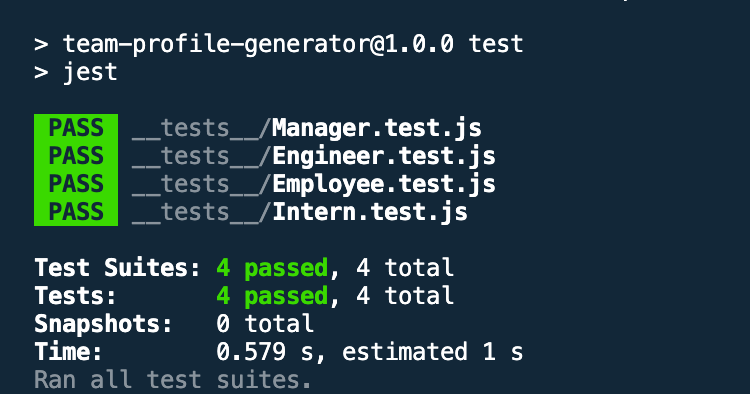
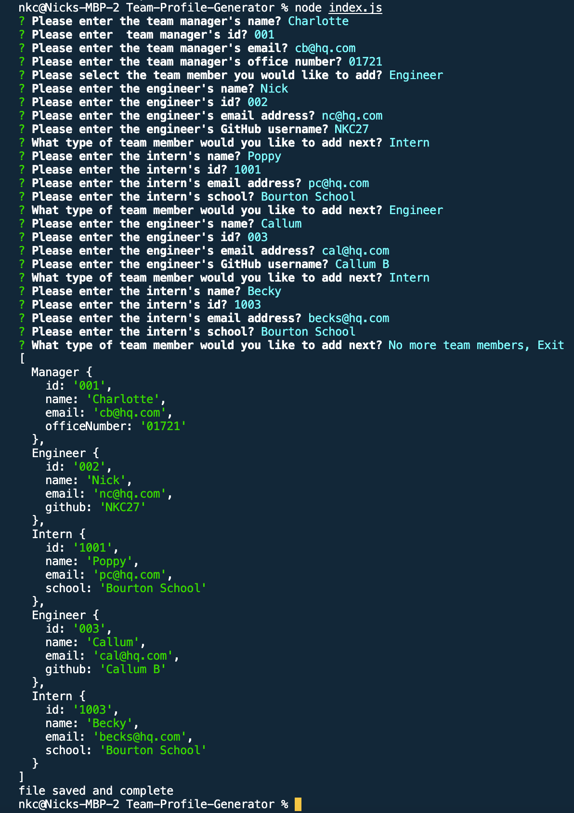
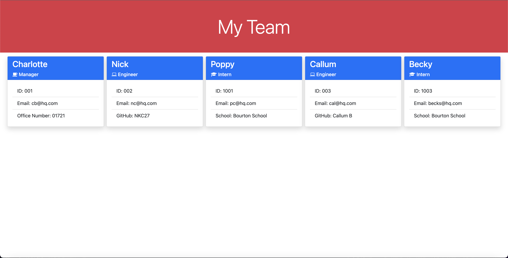

# Team Profile Generator

A command-line application that takes in information about employees on a software engineering team, then generates an HTML webpage that displays summaries for each person.

## Description

I have built an app that creates a webpage of team cards via CLI user input. The user is prompted questions in the CLI (command line interface) or Terminal with the option to add further team members through a list input.

## Installation

For installation, clone this repository and use the npm i inquirer to install 'inquirer' and npm install --save-dev jest for 'jest' please click the links below for further documentation.

[npm inquirer](https://www.npmjs.com/package/inquirer) & [npm jest](https://jestjs.io/docs/getting-started).

```bash
Please make sure you have cd to the right directory
```

# Usage

```bash
nodeJS

Javascript

HTML

CSS

Bootstrap
```

# Screenshoots

##  Here are screen shots of the application working

## Tests screen shot passing npm test for __test__ folder files



## CLI user questions, file format output, file generated & complete



## Website to show generated team



# Video Walkthrough

[](https://www.youtube.com/watch?v=2pEBzut_fXI)

# Licence

This project has the following license:

MIT

# Contributors

This project is open to contributions. 

# Questions
If you have any questions contact me on GitHub or contact https://github.com/NKC27 at n.clarke2785@gmail.com